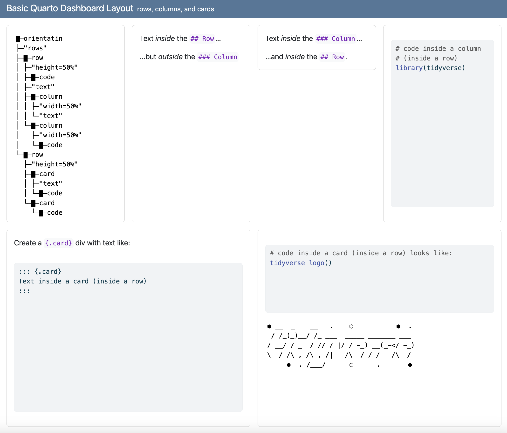
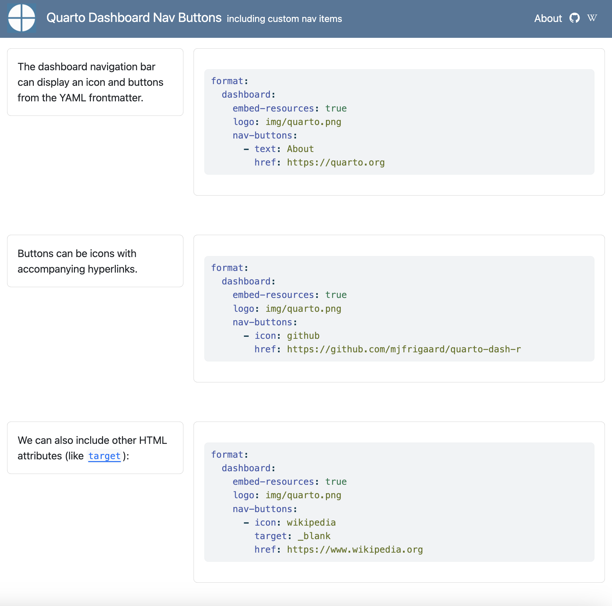

# Quarto Dashboards

This repo has example Quarto dashboards written in R. More information can be found in the official documentation[^readme-1] and the tutorial on YouTube.[^readme-2]

[^readme-1]: [Quarto dashboards.](https://quarto.org/docs/dashboards/)

[^readme-2]: Mine Çetinkaya-Rundel has an excellent three part tutorial on Posit's YouTube channel ([part 1](https://youtu.be/HW7QbqI4fH0?si=WuBui8y9uRjOVQzD), [part 2](https://www.youtube.com/watch?v=KdsQgwaY950), [part 3](https://www.youtube.com/watch?v=NigWSB-jG4Y&t=112s)).

## Dashboard layouts

Below are example dashboard layouts. Most features are included, but consult the [official documentation](https://quarto.org/docs/dashboards/) for more information.

### Page layout

[page-layout.qmd](https://github.com/mjfrigaard/quarto-dash-r/blob/main/page-layout.qmd)

### Basic row layout

[basic-row-layout.qmd](https://github.com/mjfrigaard/quarto-dash-r/blob/main/basic-row-layout.qmd)

### Basic column layout

[basic-column-layout.qmd](https://github.com/mjfrigaard/quarto-dash-r/blob/main/basic-column-layout.qmd)

### Column row layout

[column-row-layout.qmd](https://github.com/mjfrigaard/quarto-dash-r/blob/main/column-row-layout.qmd)

### Card layout

[card-layout.qmd](https://github.com/mjfrigaard/quarto-dash-r/blob/main/card-layout.qmd)

### Tabset layout

[tabset-layout.qmd](https://github.com/mjfrigaard/quarto-dash-r/blob/main/tabset-layout.qmd)

### Navbar layout

[navbar-layout.qmd](https://github.com/mjfrigaard/quarto-dash-r/blob/main/navbar-layout.qmd)

### All layout features

[layouts.qmd](https://github.com/mjfrigaard/quarto-dash-r/blob/main/layouts.qmd)

